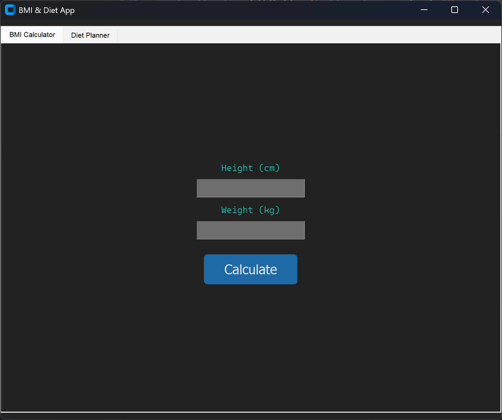
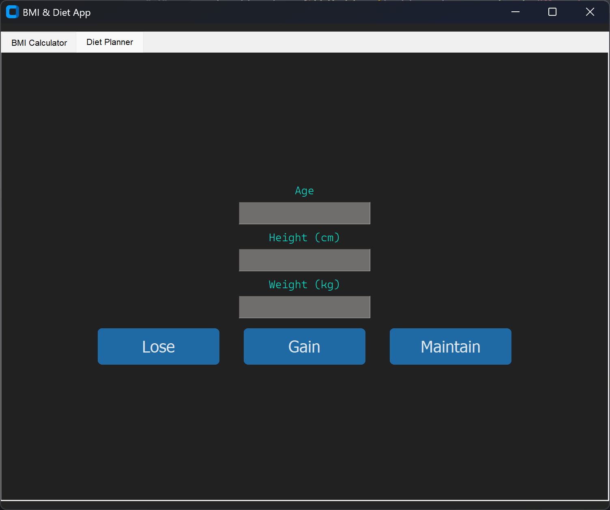

# 🧮 BMI & Diet Calculator GUI (Tkinter + CustomTkinter)

A modern and simple Body Mass Index (BMI) and personalized diet planner application built with **Tkinter** and **CustomTkinter** in Python.

This project allows users to:
- Calculate their BMI
- Get categorized results (underweight, normal, overweight, etc.)
- Generate daily caloric intake and macronutrient needs for:
  - Weight Loss
  - Weight Gain
  - Weight Maintenance

---

## 📌 Features

### ✅ BMI Calculator Tab
- Users input height (cm) and weight (kg)
- BMI is calculated and classified based on WHO standards
- Visual feedback using color-coded categories

### 🍎 Diet Planner Tab
- Users input age, height, and weight
- Three options available:
  - Weight loss diet (with 500 calorie deficit)
  - Weight gain diet (with 500 calorie surplus)
  - Weight maintenance diet (balanced BMR)
- Macronutrient breakdown (protein, fat, carbohydrate) based on common fitness ratios

---

## 🛠️ Tech Stack

| Component       | Description                                |
|----------------|--------------------------------------------|
| `Python 3.x`    | Main programming language                  |
| `Tkinter`       | For GUI elements (frames, labels, entries) |
| `CustomTkinter` | For modern buttons and enhanced UI look    |
| `ttk`           | For tab navigation                         |

---

## 📷 Screenshots

> You can add screenshots here (use GitHub’s markdown image syntax):
```markdown


